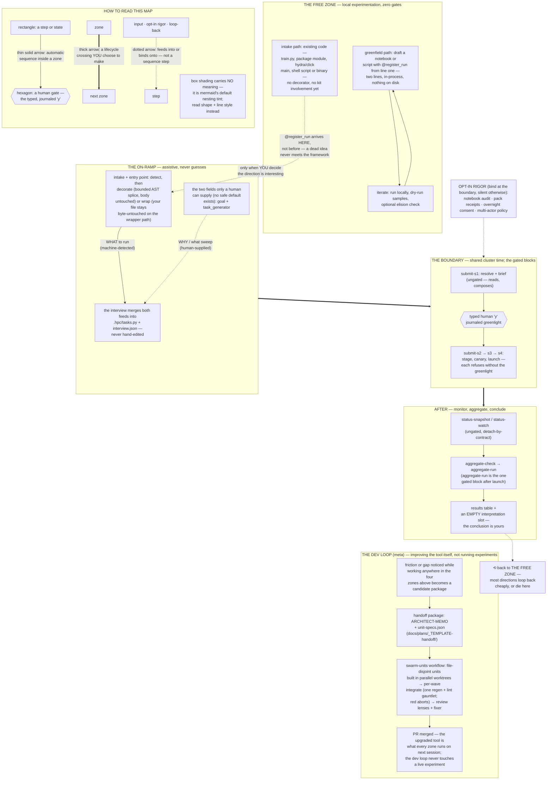

# Local experimentation to the HPC — the lifecycle, and why it is a tool

The design question this page answers: hpc-copilot must not get in the way
of local experimentation — the cheap, private, iterate-fast loop where most
directions die — and must earn its keep at the moment an experiment scales
up to shared, expensive cluster time. This page walks the real lifecycle as
shipped, shows where every gate actually binds, and states the invariants
that keep the machinery a tool rather than an oppressive workflow. Paths are
cited `path::symbol`; the sets named here have code as their source of
truth, not this prose.

## The map

## Walkthrough

**The free zone.** An experiment is a `@register_run`-decorated function
with typed kwargs — `docs/internals/experiment-contract.md` calls that
function the framework's entire contract. It can live in a jupytext
notebook, a `train.py`, or a package module; discovery
(`src/hpc_agent/experiment_kit/discover.py::discover_runs`) treats all
three as peers. Nothing else is required to experiment locally: the
`experiment_kit` package imports no gate machinery — no decision journal,
no notebook gate, no block gate — and the notebook drafting loop
(`src/hpc_agent/ops/notebook/dry_run_op.py`) is explicitly trust-neutral:
dry-run receipts journal as `execution_scope="sampled"` and are filtered
out of every attention tier and gate. You iterate at the speed of your own
editor. Nor does the decorator have to come first: existing code — a plain
`train.py`, a package module, a hydra/click main, even a shell script or
binary — experiments with zero framework involvement, and `@register_run`
is spliced or wrapped in *at the on-ramp* (next section), so a direction
that dies locally never meets the framework at all.

**The on-ramp.** When a direction earns cluster time, the tool's job is to
make the crossing cheap. `detect-entry-point`
(`src/hpc_agent/ops/detect_entry_point.py`) classifies how your code wants
to be invoked; the default path is a bounded AST splice that adds the
decorator and leaves your function body byte-identical
(`src/hpc_agent/incorporation/decorate_entry_point.py`); anything it
shouldn't rewrite (hydra, click-consuming mains, shell entry points) gets a
generated wrapper instead
(`src/hpc_agent/incorporation/wrap_entry_point.py::materialize_shell_wrapper`)
— your entry point stays untouched and the wrapper *is* the contract. The
interview (`src/hpc_agent/ops/memory/interview.py::record_interview`)
materializes `.hpc/tasks.py` and the dispatcher; neither is ever
hand-edited. Two inputs are demanded from the human and are refusable —
`goal` and `task_generator`
(`src/hpc_agent/ops/submit/field_partition.py::REQUIRED_CALLER_FIELDS`),
and the type system forbids attaching a safe default to them. Everything
else is detected, scaffolded, or comes back as a question. Where the tool
cannot decide, it refuses rather than guesses (`ambiguous_entry_point`).
The map draws two feeds merging into `tasks.py` because materializing it
genuinely needs both and neither can substitute for the other: the
machine-detected *what to run* (the entry point) and the human-supplied
*why and what sweep* (`goal` + `task_generator`) — the interview is the
join point where they meet.

**The boundary.** The gated blocks are exactly the members of
`src/hpc_agent/infra/block_chain.py::GATED_BLOCKS` — today `submit-s2`,
`submit-s3`, `submit-s4`, and `aggregate-run`: the verbs that stage to,
launch on, or spend a look at shared cluster hardware. Each calls
`src/hpc_agent/ops/block_gate.py::assert_greenlit_target` and refuses to
act without a journaled human `y` naming that verb. Everything else —
`submit-s1`, the `status-*` blocks, the `campaign-*` blocks — is ungated
and chains in code (`docs/internals/submit-sequence.md`). The rigor
machinery that *can* bind here is opt-in with a fail-safe posture: the
notebook-audit graduation gate
(`src/hpc_agent/ops/notebook_gate.py::assert_source_audited`) and the pack
receipt gate (`src/hpc_agent/ops/pack_gate.py`) return silently and
byte-identically when you never opted in, and turn loud only once you did —
opted-in-but-stale is a refusal, absent is silence. Overnight consent
(`src/hpc_agent/ops/decision/journal/overnight_consent.py`) extends the
boundary through the night with hard caps and an armed wake, and dies on
any spec change rather than lingering.

**After.** Monitoring detaches by contract and survives session death;
aggregation is idempotent and byte-identical on replay
(`src/hpc_agent/ops/aggregate_flow.py`); and at the end the tool hands
back a results table with an empty interpretation slot. The concluding
layer discloses and never gates: `cite-check` reports, challenges never
reshape a core path, `run-story` renders with no LLM anywhere in the render
path, and `doctor` (`src/hpc_agent/ops/recover/doctor.py`) drafts
proposals but restarts nothing.

**The dev loop (meta).** The swarm-units workflow
(`docs/internals/swarm-units-workflow.md`) sits *outside* the four zones:
it is how the tool itself gets improved, not a step any experiment passes
through. Friction noticed anywhere in the lifecycle becomes a handoff
package (`docs/plans/_TEMPLATE-handoff/` — an architect memo plus
file-disjoint unit specs), the workflow builds the units in parallel
worktrees, integrates each wave through a single regen + lint gauntlet
(a red gauntlet aborts the run rather than becoming the next wave's
base), passes review lenses plus a fixer, and lands as an ordinary PR.
Its streamlining is therefore indirect by design: a live experiment never
sees it; what the researcher sees is that the next session's tool has one
less rough edge.

## Where every gate binds

| Zone | What can stop you | Posture |
|---|---|---|
| Local experimentation | nothing | `experiment_kit` imports no gate machinery; drafting is trust-neutral |
| Recording a decision | authorship gates on `append-decision` | bind only when you journal; verify the human really typed the value |
| The on-ramp | `goal` + `task_generator` demanded; ambiguity refused, never guessed | questions, not gates |
| Cluster staging/launch/spend | `GATED_BLOCKS` + opt-in audit/pack gates | typed `y`; opt-in gates silent unless enabled |
| Overnight | consent with hard caps + armed wake | opt-in; parks on exhaustion, never wedges |
| Publication/conclusion | nothing — disclose-only | `cite-check`, challenges, stories never gate |

Two interpositions live outside verbs, and both constrain the *agent*, not
you: the scheduler write fence
(`src/hpc_agent/_kernel/hooks/scheduler_write_fence.py`) blocks the agent
from executing `qsub`/`sbatch`-class commands outside block code (read-only
probes and mere mentions pass — "consequences are gated, curiosity isn't"),
and the stop guards block an agent turn at most once, fail-open, when its
relay contradicts the journal. Your own shell never meets either.

## The invariants that keep it a tool

These are already load-bearing in the tree; they are stated here so future
gates are measured against them.

1. **The free zone is structurally free.** Not "no gate currently fires" —
   the local library *cannot* fire one, because it doesn't import the
   machinery. Keeping that import absence true is the cheapest possible
   enforcement of the whole stance.
2. **Gates bind where the cost is shared or irreversible, never in the
   iterate loop.** Cluster staging, launch, spending a reserved look,
   overnight autonomy, deployment registration. A red light in the free
   zone is a design bug.
3. **Opt-in rigor is silent until chosen, loud once broken.** The D7
   posture: no `audited_source` block means byte-identical behavior, not a
   nag. Rigor is a ratchet you engage when the stakes justify it — and
   engaging it is what makes it binding.
4. **Advice discloses; it never gates.** Preflights, doctors, cite checks,
   challenges, stories. The moment advisory output can block, it will be
   argued with, and then routed around — so the architecture forbids it.
5. **Degrade honestly, never wedge.** Stop guards fire at most once and
   fail open; consent parks rather than blocks; missing harness
   capabilities drop to a weaker *named* tier instead of pretending.
6. **Demand only what only the human can supply.** The goal, the task
   generator, the sign-off, the interpretation. Everything mechanical is
   scaffolded for you or refused with a question — and the gates exist to
   protect the value of exactly those human inputs, not to supervise the
   human.
7. **The exit is always open.** The shipped executor needs zero
   `hpc_agent` imports on the compute node
   (`examples/crowd-compute-executor/`), and the dispatcher is a verbatim
   stdlib-only copy. A tool you can leave is a tool; a workflow you cannot
   leave is a cage.

The same admission test in one line, for any proposed gate: *does it bind
at a rarely-crossed boundary, protect someone other than the person it
slows, stay byte-identically silent for everyone who didn't opt in, and
leave the local loop untouched?* If not, ship it as a disclosure or a
scaffold instead.
