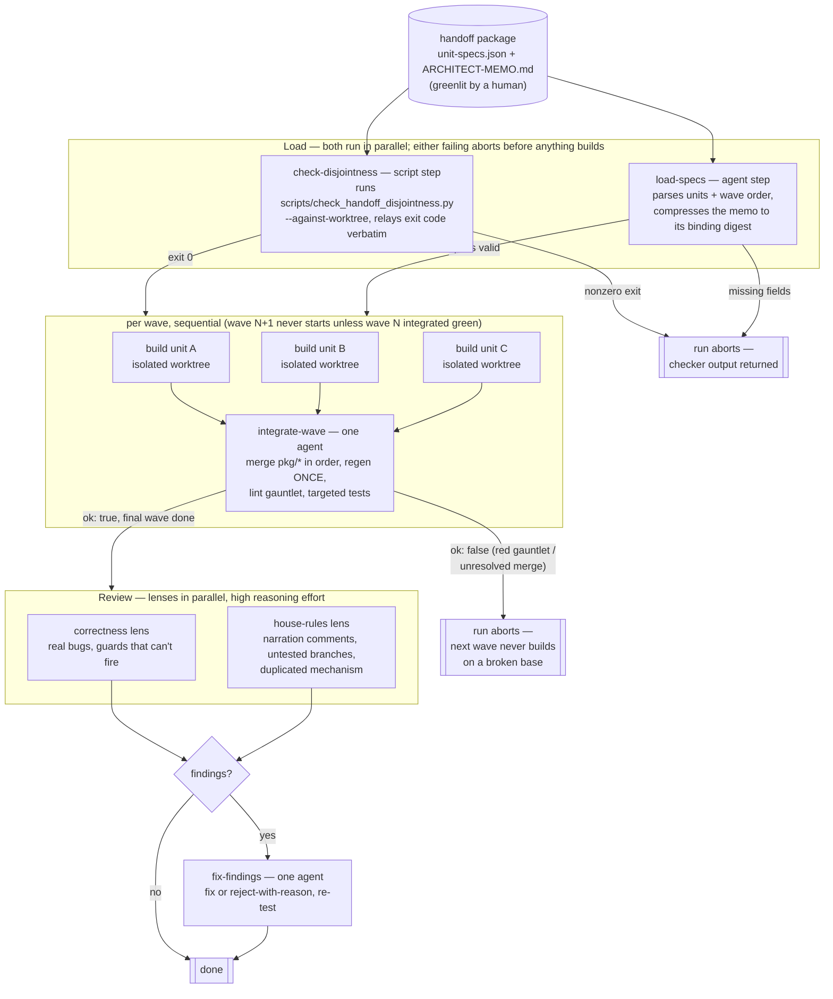

# The swarm-units workflow — a walkthrough

How a greenlit handoff package becomes integrated code. The runnable form
lives at `.claude/workflows/swarm-units.js` (portable plan + runtime
adapter; the seam contract is `.claude/workflows/README.md`), consuming the
durable artifacts of `docs/plans/_TEMPLATE-handoff/`: an architect memo and
a `unit-specs.json` of file-disjoint units. This page is the narrative
walkthrough; the script's `STEPS` table is the operational source of truth.

## The shape at a glance

A dead build agent (crashed, not failed) is re-dispatched once before its
unit is dropped; a dropped unit is reported to the integrator by name, never
silently absorbed.

## Walkthrough, phase by phase

**Load.** Two independent steps run at once. The *disjointness gate* is a
`script` step: it runs the mechanized checker and does nothing else — the
prompt forbids fixing, retrying, or interpreting, because the checker
(fire-paths pinned in `tests/scripts/test_check_handoff_disjointness.py`)
already encodes the three observed swarm failure modes: two same-wave units
claiming one file, a typo'd claim guarding nothing, and a dirty worktree
already owning a claimed file. The *loader* is an agent step doing the
judgment half: it compresses the architect memo into the binding digest every
build unit receives (the memo wins over any unit brief on conflict) and
extracts wave order and the integration protocol verbatim. Neither step
re-derives the other's work — that split is the repo's determinism boundary
(`docs/internals/principles/determinism-boundary.md`) applied to
orchestration.

**Build.** Each unit gets one agent in a fresh git worktree with an
exclusive file claim. The agent reads its own spec entry from the
`unit-specs.json` in *its* worktree — byte-exact from disk, deliberately not
round-tripped through another model's token stream. Units never talk to each
other; the file-disjointness invariant is what makes that safe. Each ends
with exactly one commit on a `pkg/<unit-id>` branch and never pushes.

**Integrate.** One agent per wave merges the `pkg/*` branches in spec order,
runs regen exactly once (units are forbidden from running it precisely so
this stays single-owner), then the lint gauntlet and targeted tests. Its
report carries an explicit `ok` verdict: `ok: false` — a red gauntlet or an
unresolved merge — aborts the whole run rather than letting the next wave
build on a broken base. Problems it *could* resolve (conflicts, amended
units) are reported, not hidden.

**Review.** Two adversarial lenses read the full integrated diff against its
merge-base — one for correctness, one for house-rules drift — and only
verified findings survive. If any do, a fixer agent adjudicates each (fix,
or reject with a reason), re-tests, and — under the default push policy —
pushes. `pushPolicy: 'hold'` keeps every commit local so a human inspects
the branch before anything leaves the machine.

## Where the gates are, and who each one protects

| Gate | Binds when | Protects |
|---|---|---|
| Human greenlight of the package | before anything runs at all | the direction — no swarm ever self-dispatches |
| Disjointness check | at dispatch | sibling units from silently editing the same seam |
| Wave barrier (`ok` verdict) | between waves | later waves from building on a red base |
| Review lenses → fixer | after the last wave | the branch from verified defects |
| `pushPolicy: 'hold'` (opt-in) | before any push | the human's right to look first |

Every row protects someone *other than the party it slows*. That is the
admission test for a gate in this workflow — a check that only enforces
taste stays a lint a person can run when they choose.

## A tool, not an oppressive workflow

The design stance, stated once so future gates are measured against it:

**The inner loop is nobody's business.** Inside a worktree, a build unit
works however it works — no step-by-step ceremony, no approval between
edits. The workflow constrains the *seams* (what files, one commit, no
push), never the process inside them. The same holds one level up: nothing
here runs until a human greenlights a package, and the one-off ancestor
scripts in `docs/plans/handoff-packages-2026-07-12/` are proof the system
tolerates bespoke runs — the saved workflow amortizes a shape that already
worked three times; it does not mandate it.

**Gates bind at boundaries crossed rarely, not at the desk.** Dispatch,
wave-merge, push: transitions where work becomes *shared* and mistakes
become expensive to unwind. This mirrors the product's own posture:
hpc-copilot's job is to stay out of local experimentation — the cheap,
private, iterate-fast loop — and earn its keep at the moment an experiment
scales up to cluster time, which is shared, expensive, and worth attesting.
A gate that would slow the local loop to protect the local loop's own author
fails the test above and shouldn't exist. The scale-up seam is also where
the tool gives rather than takes: worktree isolation, regen ownership, and
the conformance gauntlet make crossing the boundary *cheaper* than crossing
it by hand — adoption by usefulness, not enforcement.

**Overrides are deliberate, not forbidden.** `wave_order` defaults to the
specs' own order; the push gate is opt-in; a rejected review finding needs a
stated reason, not permission. Mechanized checks exist so the operator can
trust a green light and spend judgment where judgment is needed — the moment
a check's output has to be argued with routinely, it belongs back in
someone's editor, not in the gate line.

Plan-level changes (new steps, failure policy, effort tiers) go through the
`STEPS` table in the script, which self-validates before dispatching
anything — a typo in the plan fails in milliseconds, not forty minutes into
a swarm.
